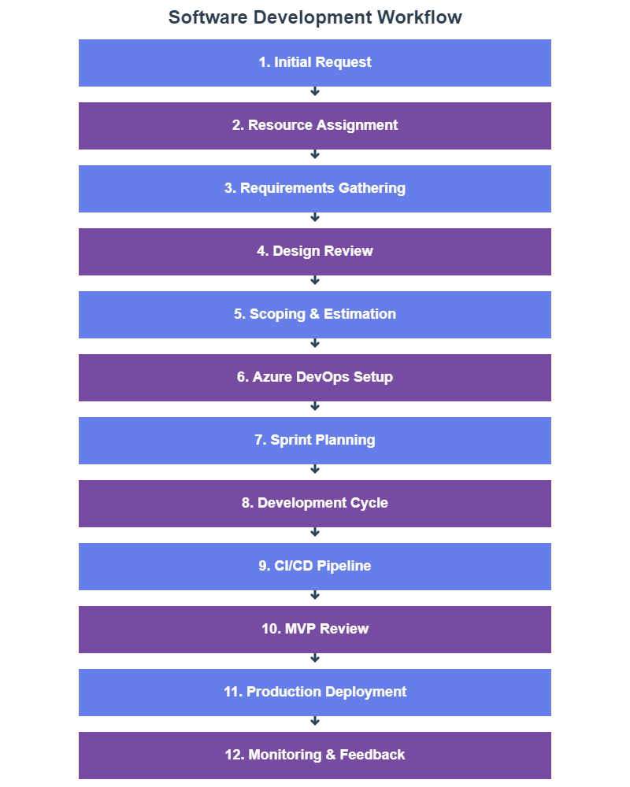
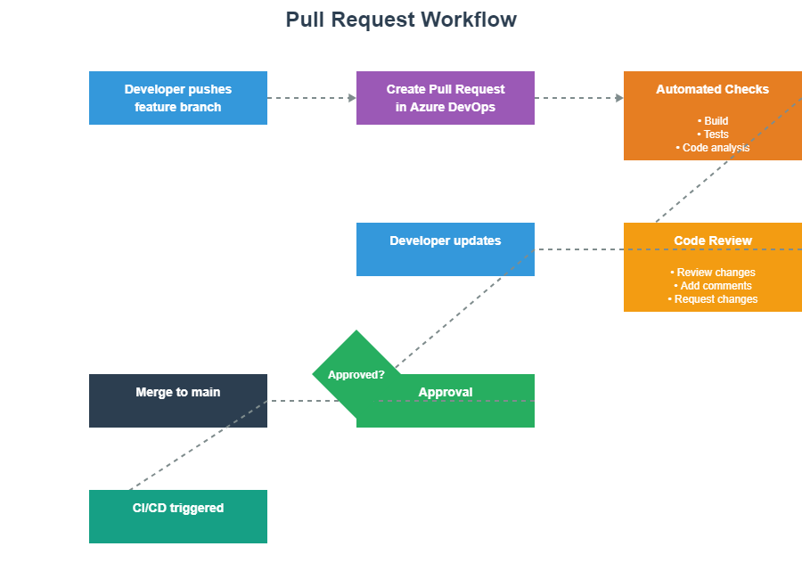
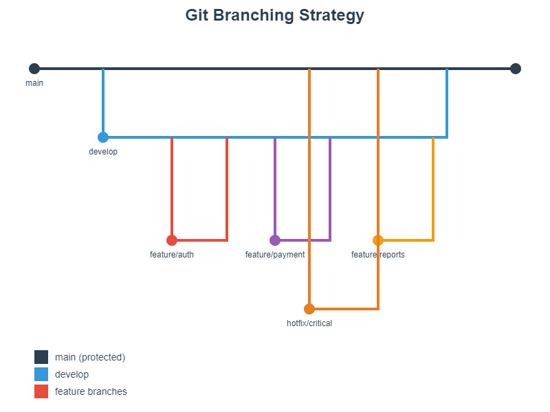
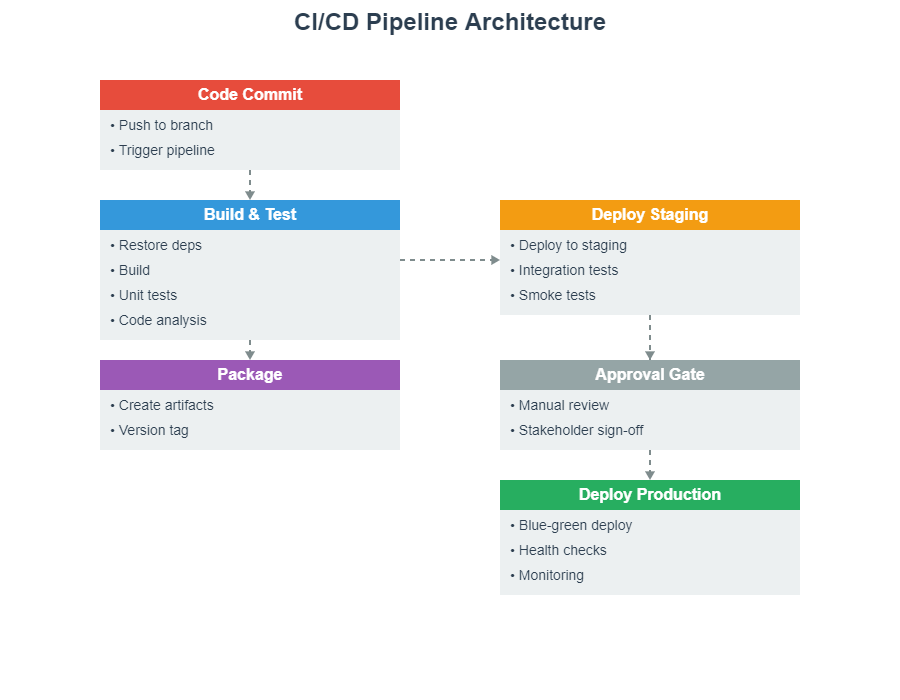

# Azure DevOps Development Guide
## A Comprehensive Setup and Workflow Strategy

**Prepared by Shawn M. Crowley for The Lycra Company**

---

## Executive Summary

This guide provides a complete workflow for setting up and using Azure DevOps with Visual Studio and Visual Studio Code. It covers repository management, development best practices, CI/CD pipeline creation, and deployment strategies. This document serves as a reference for development teams implementing modern DevOps practices using Microsoft's ecosystem.

---

## Table of Contents

1. [Initial Setup and Configuration](#initial-setup)
2. [Software Development Process Flow](#development-flow)
3. [Repository Management](#repo-management)
4. [Development Best Practices](#best-practices)
5. [CI/CD Pipeline Configuration](#cicd-pipeline)
6. [Troubleshooting and Tips](#troubleshooting)

---

## Initial Setup and Configuration {#initial-setup}

### Prerequisites

Before beginning, ensure you have:

- Active Azure DevOps account and organization
- Visual Studio 2022 (for .NET development) or Visual Studio Code (for cross-platform development)
- Git installed on your local machine
- Appropriate permissions in your Azure DevOps project

### Setting Up Visual Studio for Azure DevOps

**Step 1: Install Visual Studio**

Download and install Visual Studio 2022 from the official Microsoft website. During installation, select the following workloads:
- ASP.NET and web development
- Azure development
- .NET desktop development (as needed)

**Step 2: Connect to Azure DevOps**

1. Open Visual Studio 2022
2. Navigate to **View → Team Explorer**
3. Click on the **Connect** icon (plug symbol)
4. Select **Connect to a Project**
5. Sign in with your Microsoft/Azure account
6. Select your organization and project from the list
7. Click **Connect**

**Step 3: Configure Git Settings**

1. Go to **Tools → Options → Source Control → Git Global Settings**
2. Configure your name: `git config --global user.name "Your Name"`
3. Configure your email: `git config --global user.email "your.email@company.com"`
4. Set default branch name to 'main': `git config --global init.defaultBranch main`

### Setting Up Visual Studio Code for Azure DevOps

**Step 1: Install Visual Studio Code**

Download and install VS Code from the official website.

**Step 2: Install Required Extensions**

Open VS Code and install the following extensions:
- Azure Repos (by Microsoft)
- GitLens (by GitKraken)
- Azure Pipelines (by Microsoft)
- C# Dev Kit (for .NET projects)
- Remote Repositories (by Microsoft)

**Step 3: Connect to Azure DevOps**

1. Press `Ctrl+Shift+P` (Windows/Linux) or `Cmd+Shift+P` (Mac)
2. Type "Git: Clone" and select it
3. Choose **Clone from Azure Repos**
4. Sign in with your Microsoft/Azure account
5. Select your organization, project, and repository
6. Choose a local folder location
7. Click **Select Repository Location**

**Step 4: Configure Git in VS Code**

Open the integrated terminal in VS Code (`Ctrl+`` `) and run:

```bash
git config --global user.name "Your Name"
git config --global user.email "your.email@company.com"
git config --global core.autocrlf true
git config --global pull.rebase false
```

---

## Software Development Process Flow {#development-flow}

### Overview Diagram



This diagram illustrates the complete software development lifecycle from initial request through deployment and continuous improvement.

### Detailed Process Steps

**1. Creating a New Project in Azure DevOps**

Navigate to your Azure DevOps organization:

1. Click **+ New Project**
2. Enter project details:
   - **Project name**: Use clear, descriptive names (e.g., "CustomerPortal-2024")
   - **Description**: Detailed project purpose
   - **Visibility**: Private (recommended) or Public
   - **Version control**: Git (recommended)
   - **Work item process**: Agile or Scrum
3. Click **Create**

**2. Initializing Your Local Development Environment**

Option A: Clone Existing Repository

```bash
# Navigate to your workspace directory
cd C:\Workspace

# Clone the repository
git clone https://dev.azure.com/YourOrg/YourProject/_git/YourRepo

# Navigate into the repository
cd YourRepo

# Verify the remote connection
git remote -v
```

Option B: Initialize New Repository Locally and Connect

```bash
# Create project directory
mkdir MyNewProject
cd MyNewProject

# Initialize Git
git init

# Create initial files
echo "# MyNewProject" > README.md

# Add and commit
git add README.md
git commit -m "Initial commit"

# Add Azure DevOps remote
git remote add origin https://dev.azure.com/YourOrg/YourProject/_git/YourRepo

# Push to remote
git push -u origin main
```

**3. Creating and Managing Branches**

Branch naming conventions:

- **Feature branches**: `feature/feature-name` (e.g., `feature/user-authentication`)
- **Bug fixes**: `bugfix/bug-description` (e.g., `bugfix/login-error`)
- **Hotfixes**: `hotfix/critical-fix` (e.g., `hotfix/security-patch`)
- **Release branches**: `release/version` (e.g., `release/1.0.0`)

Creating a feature branch:

```bash
# Ensure you're on main and up to date
git checkout main
git pull origin main

# Create and switch to new feature branch
git checkout -b feature/user-authentication

# Push the branch to remote
git push -u origin feature/user-authentication
```

---

## Repository Management {#repo-management}

### Creating a Comprehensive README.md

Every repository should include a well-structured README.md file. Here's a template:

```markdown
# Project Name

## Description
Brief description of what this application does and its purpose.

## Prerequisites
- .NET 8.0 SDK
- Visual Studio 2022 or VS Code
- Azure subscription (if deploying to cloud)
- SQL Server 2022 or Azure SQL Database

## Getting Started

### Clone the Repository
```bash
git clone https://dev.azure.com/YourOrg/YourProject/_git/YourRepo
cd YourRepo
```

### Install Dependencies
```bash
dotnet restore
```

### Configuration
1. Copy `appsettings.example.json` to `appsettings.json`
2. Update connection strings and API keys
3. Configure Azure resources as needed

### Running Locally
```bash
dotnet run
```

## Project Structure
```
/src
  /ProjectName.Api        - Web API project
  /ProjectName.Core       - Business logic
  /ProjectName.Data       - Data access layer
/tests
  /ProjectName.Tests      - Unit tests
/docs                     - Additional documentation
```

## Development Workflow
1. Create feature branch from main
2. Make changes and commit regularly
3. Push to remote and create Pull Request
4. Complete code review
5. Merge to main after approval

## CI/CD Pipeline
- Automated builds on every commit
- Unit tests run automatically
- Deployment to staging on merge to main
- Production deployment via manual approval

## Contributing
Please read CONTRIBUTING.md for details on our code of conduct and development process.

## License
This project is proprietary and confidential.

## Contact
- Project Lead: [Name] (email@company.com)
- Team: [Team Name]
```

### Best Practices for Keeping Repository in Sync

**Daily Workflow**

Start of day:
```bash
# Switch to main branch
git checkout main

# Pull latest changes
git pull origin main

# Switch back to your feature branch
git checkout feature/your-feature

# Rebase your branch on latest main
git rebase main
```

End of day:
```bash
# Stage your changes
git add .

# Commit with meaningful message
git commit -m "feat: add user authentication logic"

# Push to remote
git push origin feature/your-feature
```

**Commit Message Conventions**

Use conventional commits format:

- `feat:` - New feature
- `fix:` - Bug fix
- `docs:` - Documentation changes
- `style:` - Code style changes (formatting, etc.)
- `refactor:` - Code refactoring
- `test:` - Adding or updating tests
- `chore:` - Maintenance tasks

Examples:
```bash
git commit -m "feat: add email validation to registration form"
git commit -m "fix: resolve null reference in user service"
git commit -m "docs: update API documentation for authentication"
git commit -m "refactor: simplify database query logic"
```

**Handling Merge Conflicts**

When conflicts occur:

```bash
# Pull latest changes
git pull origin main

# Git will notify you of conflicts
# Open conflicted files and resolve manually

# After resolving conflicts
git add .
git commit -m "merge: resolve conflicts from main"
git push origin feature/your-feature
```

### Pull Request Process



**Creating a Pull Request**

1. Push your feature branch to Azure DevOps
2. Navigate to **Repos → Pull Requests** in Azure DevOps
3. Click **New Pull Request**
4. Select source branch (your feature) and target branch (main)
5. Fill in PR details:
   - **Title**: Clear, descriptive title
   - **Description**: What changed and why
   - **Work Items**: Link related user stories/tasks
   - **Reviewers**: Add team members
6. Click **Create**

**Pull Request Template**

Include in your repository as `.azuredevops/pull_request_template.md`:

```markdown
## Description
Brief description of changes

## Type of Change
- [ ] Bug fix
- [ ] New feature
- [ ] Breaking change
- [ ] Documentation update

## Related Work Items
- Fixes #123
- Relates to #456

## Testing
- [ ] Unit tests added/updated
- [ ] Integration tests added/updated
- [ ] Manual testing completed

## Checklist
- [ ] Code follows project style guidelines
- [ ] Self-review completed
- [ ] Comments added for complex logic
- [ ] Documentation updated
- [ ] No new warnings generated
- [ ] Tests pass locally

## Screenshots (if applicable)

## Additional Notes
```

---

## Development Best Practices {#best-practices}

### Code Organization

**Solution Structure for .NET Projects**

```
YourSolution/
├── src/
│   ├── YourProject.Api/           # Web API or Web Application
│   ├── YourProject.Core/          # Business logic, interfaces
│   ├── YourProject.Infrastructure/ # Data access, external services
│   └── YourProject.Shared/        # Common utilities, constants
├── tests/
│   ├── YourProject.UnitTests/
│   ├── YourProject.IntegrationTests/
│   └── YourProject.E2ETests/
├── docs/
│   ├── architecture/
│   ├── api/
│   └── deployment/
├── .gitignore
├── README.md
├── azure-pipelines.yml
└── YourSolution.sln
```

### Git Workflow Best Practices

**Branch Management Strategy**



This diagram illustrates the recommended branch strategy with main, develop, feature, release, and hotfix branches.

**Branch Protection Rules**

Configure in Azure DevOps under **Project Settings → Repositories → Policies**:

1. **Require a minimum number of reviewers**: Set to 2
2. **Check for linked work items**: Enabled
3. **Check for comment resolution**: Enabled
4. **Limit merge types**: Allow only squash merge
5. **Build validation**: Require successful build before merge

### Code Review Guidelines

**For Reviewers:**

- Review within 24 hours of PR creation
- Check for code quality, not just functionality
- Provide constructive feedback
- Approve only when all concerns are addressed
- Test the changes locally if possible

**For Authors:**

- Keep PRs small and focused (under 400 lines when possible)
- Provide clear description and context
- Respond to all comments
- Update PR based on feedback
- Ensure all tests pass before requesting review

### Testing Strategy

**Unit Testing**

Create unit tests for all business logic:

```csharp
// Example using xUnit
public class UserServiceTests
{
    [Fact]
    public void CreateUser_ValidData_ReturnsUser()
    {
        // Arrange
        var userService = new UserService();
        var userData = new CreateUserDto 
        { 
            Email = "test@example.com",
            Name = "Test User"
        };

        // Act
        var result = userService.CreateUser(userData);

        // Assert
        Assert.NotNull(result);
        Assert.Equal(userData.Email, result.Email);
    }
}
```

**Integration Testing**

Test interactions between components:

```csharp
public class UserControllerIntegrationTests : IClassFixture<WebApplicationFactory<Program>>
{
    private readonly HttpClient _client;

    public UserControllerIntegrationTests(WebApplicationFactory<Program> factory)
    {
        _client = factory.CreateClient();
    }

    [Fact]
    public async Task GetUsers_ReturnsSuccessStatusCode()
    {
        // Act
        var response = await _client.GetAsync("/api/users");

        // Assert
        response.EnsureSuccessStatusCode();
    }
}
```

### Configuration Management

**Environment-Specific Settings**

Use multiple configuration files:

```
appsettings.json              # Default settings
appsettings.Development.json  # Local development
appsettings.Staging.json      # Staging environment
appsettings.Production.json   # Production environment
```

**Secrets Management**

Never commit secrets to repository. Use:

1. **Local Development**: User Secrets
```bash
dotnet user-secrets init
dotnet user-secrets set "ConnectionStrings:Database" "your-connection-string"
```

2. **Azure Deployment**: Azure Key Vault
```csharp
builder.Configuration.AddAzureKeyVault(
    new Uri($"https://{keyVaultName}.vault.azure.net/"),
    new DefaultAzureCredential());
```

---

## CI/CD Pipeline Configuration {#cicd-pipeline}

### Pipeline Architecture Diagram



This diagram shows the complete CI/CD pipeline flow from code commit through production deployment and monitoring.

### Creating Your First Pipeline

**Step 1: Create Pipeline YAML File**

Create `azure-pipelines.yml` in your repository root:

```yaml
# azure-pipelines.yml
trigger:
  branches:
    include:
    - main
    - develop
  paths:
    exclude:
    - README.md
    - docs/*

pool:
  vmImage: 'ubuntu-latest'

variables:
  buildConfiguration: 'Release'
  dotNetVersion: '8.0.x'

stages:
- stage: Build
  displayName: 'Build and Test'
  jobs:
  - job: BuildJob
    displayName: 'Build Solution'
    steps:
    - task: UseDotNet@2
      displayName: 'Use .NET SDK'
      inputs:
        version: $(dotNetVersion)
        includePreviewVersions: false

    - task: DotNetCoreCLI@2
      displayName: 'Restore Dependencies'
      inputs:
        command: 'restore'
        projects: '**/*.csproj'

    - task: DotNetCoreCLI@2
      displayName: 'Build Solution'
      inputs:
        command: 'build'
        projects: '**/*.csproj'
        arguments: '--configuration $(buildConfiguration) --no-restore'

    - task: DotNetCoreCLI@2
      displayName: 'Run Unit Tests'
      inputs:
        command: 'test'
        projects: '**/*Tests/*.csproj'
        arguments: '--configuration $(buildConfiguration) --no-build --collect:"XPlat Code Coverage"'
        publishTestResults: true

    - task: PublishCodeCoverageResults@1
      displayName: 'Publish Code Coverage'
      inputs:
        codeCoverageTool: 'Cobertura'
        summaryFileLocation: '$(Agent.TempDirectory)/**/*coverage.cobertura.xml'

    - task: DotNetCoreCLI@2
      displayName: 'Publish Application'
      inputs:
        command: 'publish'
        publishWebProjects: true
        arguments: '--configuration $(buildConfiguration) --output $(Build.ArtifactStagingDirectory)'
        zipAfterPublish: true

    - task: PublishBuildArtifacts@1
      displayName: 'Publish Artifacts'
      inputs:
        PathtoPublish: '$(Build.ArtifactStagingDirectory)'
        ArtifactName: 'drop'
        publishLocation: 'Container'

- stage: DeployStaging
  displayName: 'Deploy to Staging'
  dependsOn: Build
  condition: and(succeeded(), eq(variables['Build.SourceBranch'], 'refs/heads/main'))
  jobs:
  - deployment: DeployWeb
    displayName: 'Deploy Web App'
    environment: 'staging'
    strategy:
      runOnce:
        deploy:
          steps:
          - task: AzureWebApp@1
            displayName: 'Deploy to Azure App Service'
            inputs:
              azureSubscription: 'Azure-Connection'
              appType: 'webApp'
              appName: 'your-app-staging'
              package: '$(Pipeline.Workspace)/drop/**/*.zip'
              deploymentMethod: 'auto'

          - task: AzureAppServiceManage@0
            displayName: 'Restart App Service'
            inputs:
              azureSubscription: 'Azure-Connection'
              Action: 'Restart Azure App Service'
              WebAppName: 'your-app-staging'

- stage: DeployProduction
  displayName: 'Deploy to Production'
  dependsOn: DeployStaging
  condition: succeeded()
  jobs:
  - deployment: DeployWeb
    displayName: 'Deploy Web App'
    environment: 'production'
    strategy:
      runOnce:
        deploy:
          steps:
          - task: AzureWebApp@1
            displayName: 'Deploy to Azure App Service'
            inputs:
              azureSubscription: 'Azure-Connection'
              appType: 'webApp'
              appName: 'your-app-production'
              package: '$(Pipeline.Workspace)/drop/**/*.zip'
              deploymentMethod: 'auto'
              deployToSlotOrASE: true
              resourceGroupName: 'your-resource-group'
              slotName: 'staging'

          - task: AzureAppServiceManage@0
            displayName: 'Swap Slots'
            inputs:
              azureSubscription: 'Azure-Connection'
              Action: 'Swap Slots'
              WebAppName: 'your-app-production'
              ResourceGroupName: 'your-resource-group'
              SourceSlot: 'staging'
```

**Step 2: Configure Pipeline in Azure DevOps**

1. Navigate to **Pipelines → Pipelines**
2. Click **New Pipeline**
3. Select **Azure Repos Git**
4. Select your repository
5. Choose **Existing Azure Pipelines YAML file**
6. Select `/azure-pipelines.yml`
7. Click **Run**

### Advanced Pipeline Features

**Multi-Stage Pipeline with Approval Gates**

```yaml
stages:
- stage: Build
  jobs:
  - job: BuildJob
    # Build steps here

- stage: DeployStaging
  dependsOn: Build
  jobs:
  - deployment: DeployStaging
    environment: 'staging'
    # Deploy steps here

- stage: ApprovalGate
  dependsOn: DeployStaging
  jobs:
  - job: waitForValidation
    displayName: 'Wait for external validation'
    pool: server
    timeoutInMinutes: 4320 # 3 days
    steps:
    - task: ManualValidation@0
      inputs:
        notifyUsers: 'project-managers@company.com'
        instructions: 'Please validate staging deployment and approve for production'

- stage: DeployProduction
  dependsOn: ApprovalGate
  jobs:
  - deployment: DeployProduction
    environment: 'production'
    # Deploy steps here
```

**Variable Groups for Environment Configuration**

1. Navigate to **Pipelines → Library**
2. Click **+ Variable group**
3. Name it (e.g., "Production-Variables")
4. Add variables:
   - `AppServiceName`: your-app-production
   - `ResourceGroup`: your-rg-production
5. Link to Azure Key Vault for secrets (optional)
6. Save

Reference in pipeline:

```yaml
variables:
- group: Production-Variables

steps:
- task: AzureWebApp@1
  inputs:
    appName: $(AppServiceName)
    resourceGroupName: $(ResourceGroup)
```

### Pipeline Templates for Reusability

Create `/pipelines/templates/build-template.yml`:

```yaml
parameters:
- name: buildConfiguration
  type: string
  default: 'Release'
- name: dotNetVersion
  type: string
  default: '8.0.x'

steps:
- task: UseDotNet@2
  displayName: 'Use .NET SDK ${{ parameters.dotNetVersion }}'
  inputs:
    version: ${{ parameters.dotNetVersion }}

- task: DotNetCoreCLI@2
  displayName: 'Restore'
  inputs:
    command: 'restore'

- task: DotNetCoreCLI@2
  displayName: 'Build'
  inputs:
    command: 'build'
    arguments: '--configuration ${{ parameters.buildConfiguration }}'

- task: DotNetCoreCLI@2
  displayName: 'Test'
  inputs:
    command: 'test'
    arguments: '--configuration ${{ parameters.buildConfiguration }}'
```

Use in main pipeline:

```yaml
stages:
- stage: Build
  jobs:
  - job: BuildJob
    steps:
    - template: pipelines/templates/build-template.yml
      parameters:
        buildConfiguration: 'Release'
        dotNetVersion: '8.0.x'
```

---

## Troubleshooting and Tips {#troubleshooting}

### Common Issues and Solutions

**Issue: Git Push Fails with Authentication Error**

Solution:
```bash
# Clear cached credentials
git credential-cache exit

# Or use credential manager
git config --global credential.helper manager

# Re-authenticate on next push
git push origin main
```

**Issue: Merge Conflicts During Rebase**

Solution:
```bash
# Start rebase
git rebase main

# If conflicts occur, resolve them in your IDE
# Then:
git add .
git rebase --continue

# If you want to abort
git rebase --abort
```

**Issue: Pipeline Fails to Find Dependencies**

Solution:
Check your `azure-pipelines.yml` includes proper restore step:
```yaml
- task: DotNetCoreCLI@2
  displayName: 'Restore NuGet Packages'
  inputs:
    command: 'restore'
    projects: '**/*.csproj'
    feedsToUse: 'select'
    vstsFeed: 'YourFeedName'  # If using Azure Artifacts
```

**Issue: Unable to Push Large Files**

Solution:
```bash
# Install Git LFS
git lfs install

# Track large file types
git lfs track "*.psd"
git lfs track "*.zip"

# Add .gitattributes
git add .gitattributes

# Commit and push
git commit -m "Add Git LFS tracking"
git push origin main
```

### Performance Optimization Tips

**1. Shallow Clones for CI/CD**

In pipeline YAML:
```yaml
steps:
- checkout: self
  fetchDepth: 1  # Only fetch latest commit
```

**2. Caching Dependencies**

```yaml
- task: Cache@2
  inputs:
    key: 'nuget | "$(Agent.OS)" | **/packages.lock.json'
    restoreKeys: |
      nuget | "$(Agent.OS)"
    path: $(NUGET_PACKAGES)
  displayName: 'Cache NuGet packages'
```

**3. Parallel Job Execution**

```yaml
jobs:
- job: UnitTests
  steps:
  - script: dotnet test UnitTests.csproj

- job: IntegrationTests
  steps:
  - script: dotnet test IntegrationTests.csproj
```

### Security Best Practices

**1. Secure Pipeline Variables**

- Use secret variables for sensitive data
- Store secrets in Azure Key Vault
- Reference Key Vault in pipeline:

```yaml
- task: AzureKeyVault@2
  inputs:
    azureSubscription: 'Azure-Connection'
    KeyVaultName: 'your-keyvault'
    SecretsFilter: '*'
    RunAsPreJob: true
```

**2. Branch Protection**

Configure in **Project Settings → Repositories → Policies**:
- Require pull requests for main branch
- Require minimum 2 reviewers
- Require build validation
- Require linked work items

**3. Code Scanning**

Add security scanning to pipeline:

```yaml
- task: WhiteSource@21
  displayName: 'WhiteSource Scan'
  inputs:
    cwd: '$(System.DefaultWorkingDirectory)'

- task: CredScan@3
  displayName: 'Credential Scanner'
```

### Monitoring and Diagnostics

**Application Insights Integration**

Add to your application:

```csharp
// Program.cs
builder.Services.AddApplicationInsightsTelemetry(
    builder.Configuration["ApplicationInsights:ConnectionString"]);
```

**Pipeline Analytics**

Monitor pipeline performance:
1. Navigate to **Pipelines → Analytics**
2. Review:
   - Pass rate trends
   - Duration trends
   - Failure analysis
   - Test analytics

**Create Custom Dashboard**

1. Navigate to **Overview → Dashboards**
2. Click **New Dashboard**
3. Add widgets:
   - Build history
   - Test results trend
   - Deployment status
   - Work item progress

---

## Appendix: Quick Reference Commands

### Git Commands Cheatsheet

```bash
# Repository Setup
git clone <url>                          # Clone repository
git init                                 # Initialize new repository
git remote add origin <url>              # Add remote

# Daily Workflow
git status                               # Check status
git pull origin main                     # Pull latest changes
git checkout -b feature/name             # Create new branch
git add .                                # Stage all changes
git commit -m "message"                  # Commit changes
git push origin feature/name             # Push branch

# Branch Management
git branch                               # List branches
git branch -d feature/name               # Delete local branch
git push origin --delete feature/name    # Delete remote branch
git checkout main                        # Switch to main
git merge feature/name                   # Merge branch

# Advanced
git stash                                # Stash changes
git stash pop                            # Apply stashed changes
git rebase main                          # Rebase on main
git reset --hard HEAD~1                  # Undo last commit
git log --oneline --graph                # View commit history

# Cleanup
git clean -fd                            # Remove untracked files
git gc                                   # Garbage collection
```

### Azure CLI Commands for DevOps

```bash
# Login
az login
az devops configure --defaults organization=https://dev.azure.com/YourOrg project=YourProject

# Repository Management
az repos list
az repos create --name NewRepo
az repos show --repository YourRepo

# Pipeline Management
az pipelines list
az pipelines run --name YourPipeline
az pipelines show --name YourPipeline

# Work Items
az boards work-item create --title "New Task" --type Task
az boards work-item show --id 123
az boards work-item update --id 123 --state "Active"
```

### Visual Studio Keyboard Shortcuts

```
# Git Operations
Ctrl+0, G                    # Open Team Explorer
Ctrl+0, Ctrl+M               # Open Team Explorer - Pending Changes
Ctrl+K, Ctrl+P               # Push changes
Alt+0                        # Open Git Changes window

# Navigation
Ctrl+T                       # Go to All
Ctrl+,                       # Go to File
Ctrl+Q                       # Quick Launch
F12                          # Go to Definition
Shift+F12                    # Find All References

# Editing
Ctrl+K, Ctrl+C               # Comment selection
Ctrl+K, Ctrl+U               # Uncomment selection
Ctrl+K, Ctrl+D               # Format document
Ctrl+.                       # Quick actions

# Build & Debug
F5                           # Start debugging
Ctrl+F5                      # Start without debugging
Ctrl+Shift+B                 # Build solution
```

### VS Code Keyboard Shortcuts

```
# Git Operations
Ctrl+Shift+G                 # Open Source Control
Ctrl+Shift+G, G              # Stage changes
Ctrl+Enter                   # Commit
Ctrl+Shift+P                 # Command Palette

# Navigation
Ctrl+P                       # Quick Open file
Ctrl+Shift+O                 # Go to Symbol
F12                          # Go to Definition
Alt+F12                      # Peek Definition

# Editing
Ctrl+/                       # Toggle comment
Shift+Alt+F                  # Format document
Ctrl+Space                   # Trigger suggestions
F2                           # Rename symbol

# Terminal
Ctrl+`                       # Toggle terminal
Ctrl+Shift+`                 # Create new terminal
```

---

## Conclusion

This guide provides a comprehensive foundation for implementing Azure DevOps in your development workflow. Key takeaways:

1. **Start with proper setup**: Configure your IDE and Git settings correctly from the beginning
2. **Follow the process**: Adhere to the development workflow from initial request through deployment
3. **Maintain discipline**: Keep your repository clean, branches organized, and commits meaningful
4. **Automate everything**: Leverage CI/CD pipelines to reduce manual errors and increase efficiency
5. **Continuous improvement**: Regularly review and refine your processes based on team feedback

The combination of Visual Studio/VS Code with Azure DevOps provides a powerful platform for modern software development. By following these best practices and workflows, your team can achieve:

- Faster deployment cycles
- Higher code quality through automated testing
- Better collaboration through structured code reviews
- Increased visibility into project status
- Reduced manual effort through automation

Remember that DevOps is not just about tools—it's about culture, collaboration, and continuous improvement. Use this guide as your foundation, but adapt it to fit your team's specific needs and context.

---

**Document Version**: 1.0  
**Last Updated**: January 2026  
**Maintained By**: Shawn M. Crowley  
**Next Review**: Quarterly

For questions or suggestions regarding this guide, please contact the DevOps team or submit feedback through your Azure DevOps project.